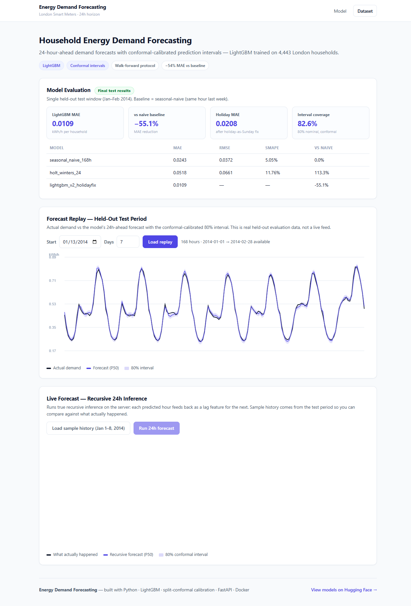

# London Energy Demand Forecasting



24-hour-ahead forecasting of hourly household electricity demand — **LightGBM** trained on 4,443 London households (Smart Meters in London), with **conformal-calibrated prediction intervals**, served via FastAPI + Docker.

- Models: [neuronsbyisshu/london-energy-demand-forecast-lgbm](https://huggingface.co/neuronsbyisshu/london-energy-demand-forecast-lgbm)
- Dataset: [Smart Meters in London](https://www.kaggle.com/datasets/jeanmidev/smart-meters-in-london) (Kaggle)
- Horizon: 24 hours · Target: hourly mean household demand (kWh), Std-tariff households

## Results — held-out test (Jan–Feb 2014, time-based split)

| Model | Test MAE | vs naive |
|---|---|---|
| Seasonal-naive (t-168) | 0.0243 | — |
| Holt-Winters (rejected) | 0.0518 | +113% |
| **LightGBM v2** | **0.0109** | **−55.1%** |

v1 protocol metrics: RMSE 0.0158, sMAPE 2.38%.

**Prediction intervals:** quantile LightGBM (P10/P50/P90) alone covered only 64% of test points. After **split-conformal calibration** on validation residuals: **82.6% empirical coverage** at a nominal 80%, with no meaningful width increase.

**Error-driven iteration:** Phase 4 analysis showed holidays were the dominant failure mode (2.4× MAE; too few examples for a binary flag to help). The **holiday-as-Sunday** fix (re-encode holiday rows as `dow=6, is_weekend=1`) cut holiday MAE by 20.6% with no overall regression — adopted as v2 after a controlled same-seed experiment.

## Pipeline

```
Smart Meters (167M rows, 112 blocks) → Std-tariff aggregate hourly series
→ lag/rolling/calendar/weather features → Seasonal-Naive → Holt-Winters → LightGBM
→ time-based holdout evaluation → error analysis → holiday fix (v2)
→ quantile models → split-conformal calibration → FastAPI + Docker
```

## API

| Endpoint | Description |
|---|---|
| `GET /api/v1/health` | liveness |
| `GET /api/v1/stats` | metrics, conformal config, split protocol |
| `GET /api/v1/replay?start=YYYY-MM-DD&days=N` | held-out test predictions + actuals (demo replay) |
| `POST /api/v1/forecast` | recursive 24h forecast with conformal interval |

`POST /api/v1/forecast` body:

```json
{
  "history": [0.31, 0.28, "…168+ hourly demand values…"],
  "start": "2014-02-15T00:00:00Z",
  "weather_history": {"temperature": ["…24 values…"]}
}
```

Note on horizons: the headline 0.0109 MAE is a **direct** 24h-ahead evaluation (true history for lags). The live `/forecast` endpoint is **recursive** — each predicted hour feeds back as a lag input — so its error compounds over the 24 steps and will read higher. Both numbers are reported transparently.

## Run locally

```bash
pip install -r requirements.txt
uvicorn app.main:app --host 127.0.0.1 --port 8000
```

Open http://localhost:8000 — replay + live forecast UI. API docs at `/docs`.

## Docker

```bash
docker build -t energy-demand-forecast .
docker run -p 8000:8000 energy-demand-forecast
```

Models are pulled from Hugging Face Hub at container startup — the image stays small. Every push to `main` rebuilds and pushes `DOCKER_USERNAME/energy-demand-forecast:latest` via GitHub Actions.

## Notebooks (`notebooks/`)

| Notebook | Contents |
|---|---|
| `04b_holiday_fix_experiment.ipynb` | controlled A/B: original vs holiday-as-Sunday encoding |
| `05_hf_model_upload.ipynb` | HF Hub publication (v2 model set, config, model card) |

(Phase 1–4 notebooks: dataset inspection, series construction + EDA, feature engineering + model comparison, error analysis + conformal calibration.)

## Known limitations

- Holiday MAE still ~2× normal after the fix (few training examples — documented, not hidden)
- Weather inputs assume a perfect weather forecast at prediction time
- Trained on 2013 London data; regime shifts need retraining
